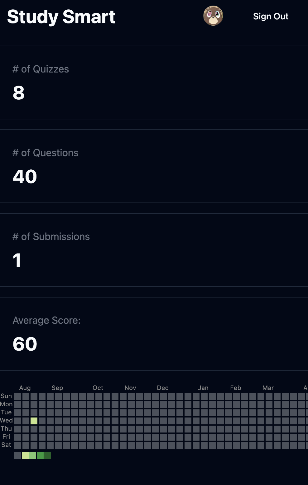
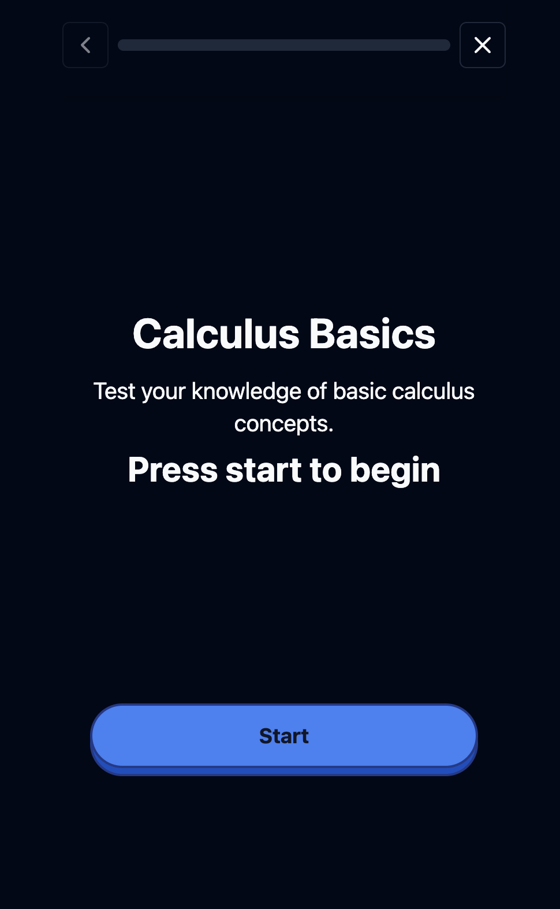
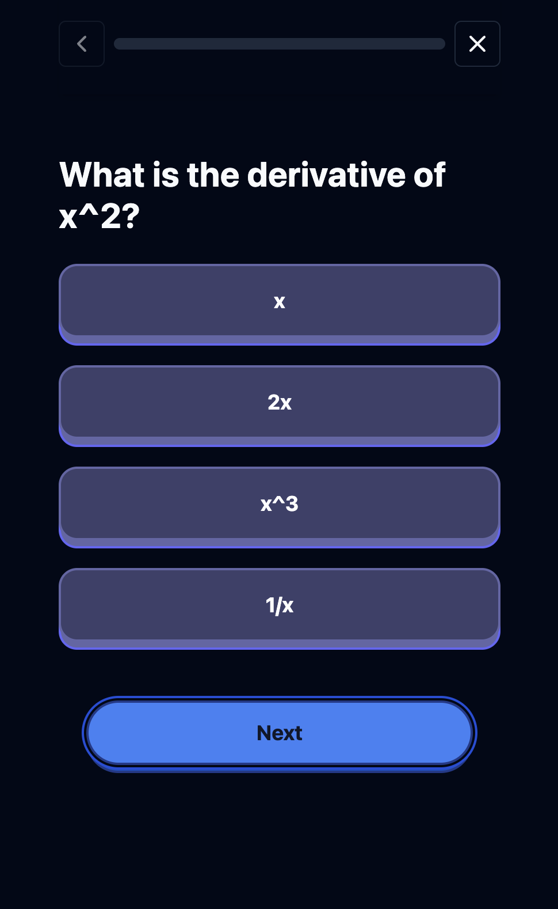
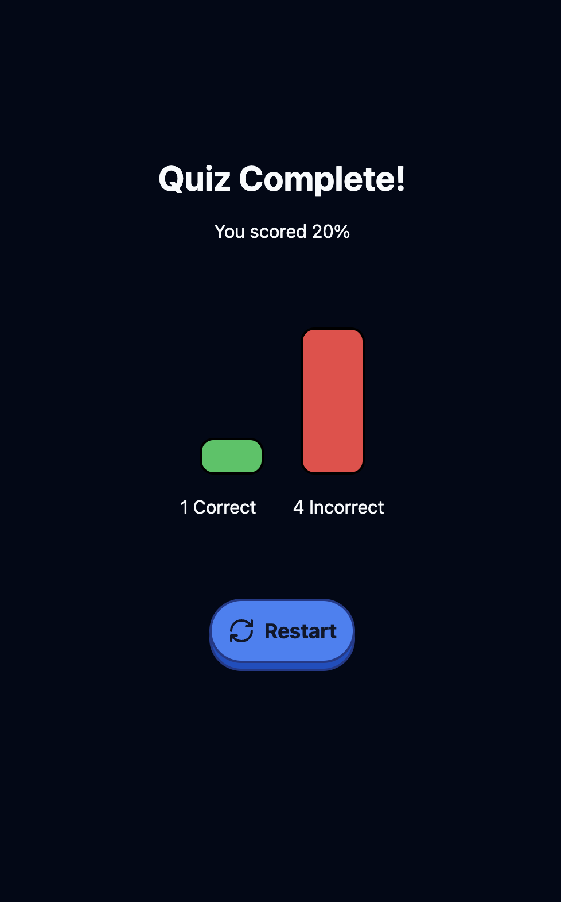
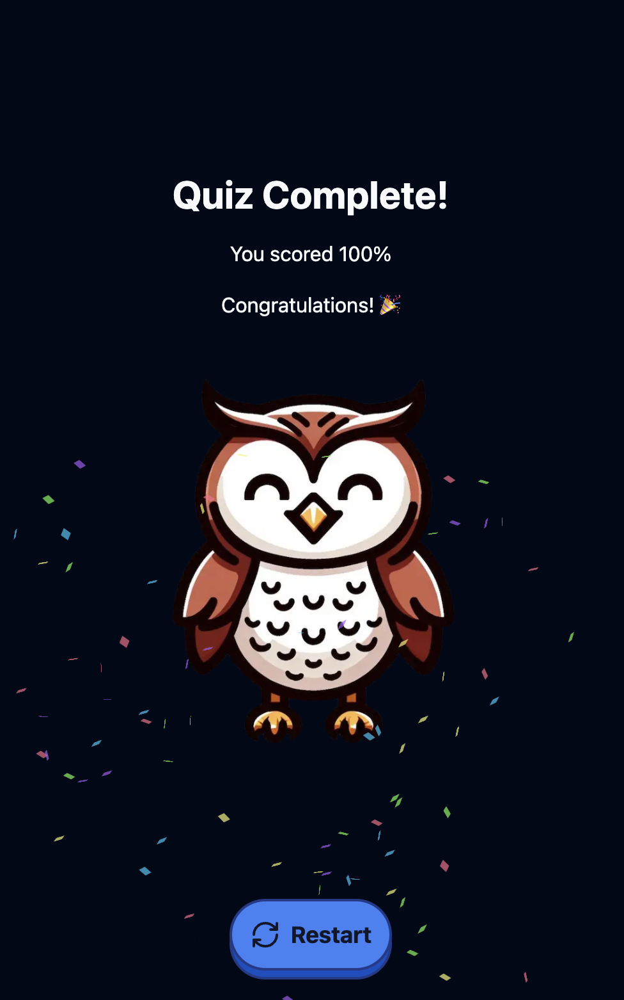
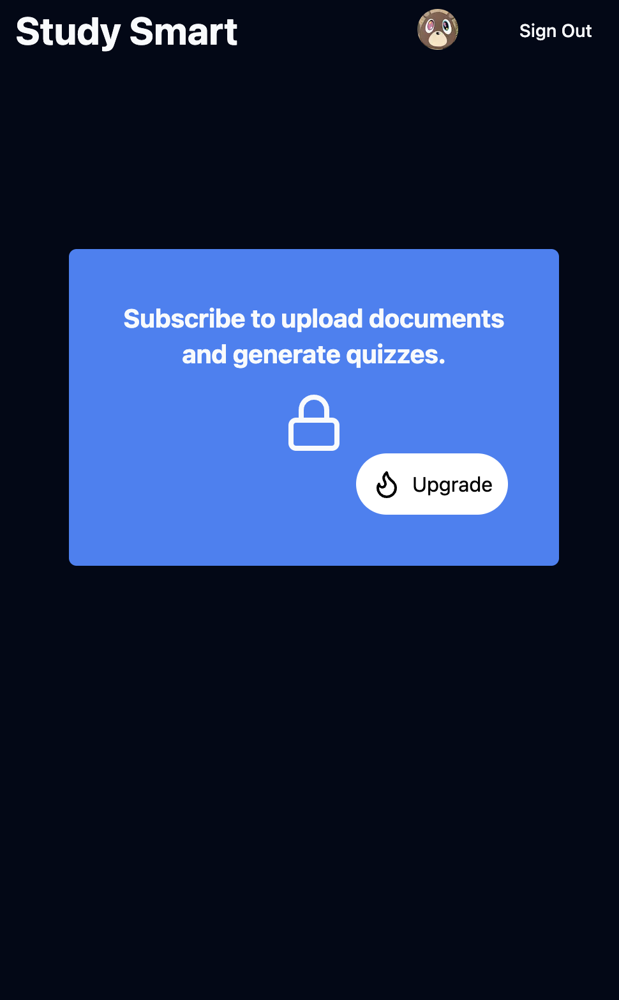

<a name="readme-top"></a>
[![Contributors][contributors-shield]][contributors-url]
[![Stargazers][stars-shield]][stars-url]
[![Issues][issues-shield]][issues-url]
[![LinkedIn][linkedin-shield]][linkedin-url]

<!-- PROJECT LOGO -->
<br />
<div align="center">
  <h3 align="center">StudySmart</h3>

  <p align="center">
    An AI-powered application to help students prepare for exams by generating mock tests from their uploaded study materials.
    <br />
    <a href="https://github.com/benshandd/StudySmart"><strong>Explore the docs »</strong></a>
    <br />
    <br />
    <a href="https://github.com/benshandd/StudySmart/issues/new?labels=bug&template=bug-report---.md">Report Bug</a>
    ·
    <a href="https://github.com/benshandd/StudySmart/issues/new?labels=enhancement&template=feature-request---.md">Request Feature</a>
  </p>
</div>

<!-- TABLE OF CONTENTS -->
<details>
  <summary>Table of Contents</summary>
  <ol>
    <li>
      <a href="#about-the-project">About The Project</a>
      <ul>
        <li><a href="#built-with">Built With</a></li>
      </ul>
    </li>
    <li>
      <a href="#getting-started">Getting Started</a>
      <ul>
        <li><a href="#prerequisites">Prerequisites</a></li>
        <li><a href="#installation">Installation</a></li>
      </ul>
    </li>
    <li><a href="#usage">Usage</a></li>
    <li><a href="#roadmap">Roadmap</a></li>
    <li><a href="#contributing">Contributing</a></li>
    <li><a href="#license">License</a></li>
    <li><a href="#contact">Contact</a></li>
    <li><a href="#acknowledgments">Acknowledgments</a></li>
  </ol>
</details>

<!-- ABOUT THE PROJECT -->
## About The Project

StudySmart is an AI-powered application designed to assist students in preparing for exams by generating mock tests from their uploaded study materials. By leveraging advanced AI models, StudySmart helps students focus on key areas and practice with custom-generated questions tailored to their materials.

## Screenshots

<div style="display: flex; flex-wrap: wrap; justify-content: space-around;">

  
  
  
  
  
  
  

</div>


<p align="right">(<a href="#readme-top">back to top</a>)</p>

### Built With

* [![Node.js][node-js]][node-url]
* [![TypeScript][typescript-shield]][typescript-url]
* [![PostgreSQL][postgresql-shield]][postgresql-url]
* [![OpenAI API][openai-shield]][openai-url]
* [![Langchain][langchain-shield]][langchain-url]
* [![Drizzle][drizzle-shield]][drizzle-url]
* [![NextAuth][nextauth-shield]][nextauth-url]


<!-- GETTING STARTED -->
## Getting Started

To get a local copy up and running, follow these simple steps.

### Prerequisites

* npm
  ```sh
  npm install npm@latest -g
  ```

### Installation

1. Clone the repo
   ```sh
   git clone https://github.com/benshandd/StudySmart.git
   ```
2. Install NPM packages
   ```sh
   npm install
   ```
3. Set up the database
   ```sh
   npm run db:setup
   ```
4. Create a `.env` file and configure your environment variables
   ```sh
    OPENAI_API_KEY="your_openai_api_key"
    GOOGLE_CLIENT_ID="your_google_client_id"
    GOOGLE_CLIENT_SECRET="your_google_client_secret"
    AUTH_SECRET="your_auth_secret"
    DATABASE_URL="your_database_url"
    NEXT_PUBLIC_PUBLISHABLE_KEY="your_next_public_publishable_key"
    STRIPE_SECRET_KEY="your_stripe_secret_key"
    STRIPE_WEBHOOK_SECRET="your_stripe_webhook_secret"
    STRIPE_WEBHOOK_LOCAL_SECRET="your_stripe_webhook_local_secret"
   
   ```

<p align="right">(<a href="#readme-top">back to top</a>)</p>

<!-- USAGE EXAMPLES -->
## Usage

To use StudySmart, upload your study materials, and the AI will generate a mock test tailored to your content. You can then review and practice the generated questions to enhance your exam preparation.

<p align="right">(<a href="#readme-top">back to top</a>)</p>

<!-- CONTRIBUTING -->
## Contributing

Contributions are what make the open-source community such an amazing place to learn, inspire, and create. Any contributions you make are **greatly appreciated**.

If you have a suggestion that would make this project better, please fork the repo and create a pull request. You can also simply open an issue with the tag "enhancement".
Don't forget to give the project a star! Thanks again!

1. Fork the Project
2. Create your Feature Branch (`git checkout -b feature/AmazingFeature`)
3. Commit your Changes (`git commit -m 'Add some AmazingFeature'`)
4. Push to the Branch (`git push origin feature/AmazingFeature`)
5. Open a Pull Request

<p align="right">(<a href="#readme-top">back to top</a>)</p>

<!-- LICENSE -->
## License

Distributed under the MIT License. See `LICENSE.txt` for more information.

<p align="right">(<a href="#readme-top">back to top</a>)</p>

<!-- CONTACT -->
## Contact

Ben Shand - benjaminshand101@gmail.com

Project Link: [https://github.com/benshandd/StudySmart](https://github.com/benshandd/StudySmart)

<p align="right">(<a href="#readme-top">back to top</a>)</p>

<!-- ACKNOWLEDGMENTS -->
## Acknowledgments

* [OpenAI](https://www.openai.com/)
* [Langchain](https://langchain.com/)
* [NextAuth](https://next-auth.js.org/)
* [Drizzle](https://drizzle-orm.com/)

<p align="right">(<a href="#readme-top">back to top</a>)</p>

<!-- MARKDOWN LINKS & IMAGES -->
<!-- https://www.markdownguide.org/basic-syntax/#reference-style-links -->
[contributors-shield]: https://img.shields.io/github/contributors/benshandd/StudySmart.svg?style=for-the-badge
[contributors-url]: https://github.com/benshandd/StudySmart/graphs/contributors
[stars-shield]: https://img.shields.io/github/stars/benshandd/StudySmart.svg?style=for-the-badge
[stars-url]: https://github.com/benshandd/StudySmart/stargazers
[issues-shield]: https://img.shields.io/github/issues/benshandd/StudySmart.svg?style=for-the-badge
[issues-url]: https://github.com/benshandd/StudySmart/issues
[linkedin-shield]: https://img.shields.io/badge/-LinkedIn-black.svg?style=for-the-badge&logo=linkedin&colorB=555
[linkedin-url]: https://www.linkedin.com/in/benshand/
[typescript-shield]: https://img.shields.io/badge/TypeScript-3178C6?style=for-the-badge&logo=typescript&logoColor=white
[typescript-url]: https://www.typescriptlang.org/

[node-js]: https://img.shields.io/badge/Node.js-339933?style=for-the-badge&logo=node.js&logoColor=white
[node-url]: https://nodejs.org/

[postgresql-shield]: https://img.shields.io/badge/PostgreSQL-336791?style=for-the-badge&logo=postgresql&logoColor=white
[postgresql-url]: https://www.postgresql.org/

[openai-shield]: https://img.shields.io/badge/OpenAI-412991?style=for-the-badge&logo=openai&logoColor=white
[openai-url]: https://openai.com/

[langchain-shield]: https://img.shields.io/badge/Langchain-0052CC?style=for-the-badge&logo=confluence&logoColor=white
[langchain-url]: https://langchain.com/

[nextauth-shield]: https://img.shields.io/badge/NextAuth.js-000000?style=for-the-badge&logo=next.js&logoColor=white
[nextauth-url]: https://next-auth.js.org/

[drizzle-shield]: https://img.shields.io/badge/Drizzle-3D4AD7?style=for-the-badge&logo=drizzle&logoColor=white
[drizzle-url]: https://drizzle-orm.com/

